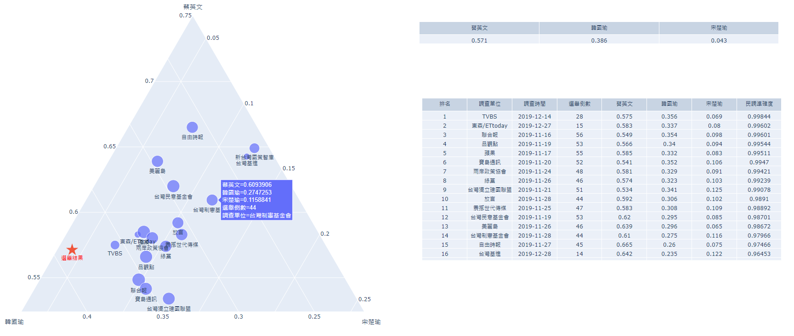

# 台灣選舉民調劉伯溫


- setup
    ```bash
    python -m venv venv
    source venv/bin/activate
    python -m pip install --upgrade pip 
    pip install -r requirements.txt
    ```
- edit `./main.py` :
    
    反註解欲運行的程式碼行

    如欲繪製 2020總統選舉民調分布圖，可選擇執行 : `ElectionPollsPresident2020.plot_ternary()`

- run
    ```bash
    source venv/bin/activate
    python main.py
    ```

- result
    